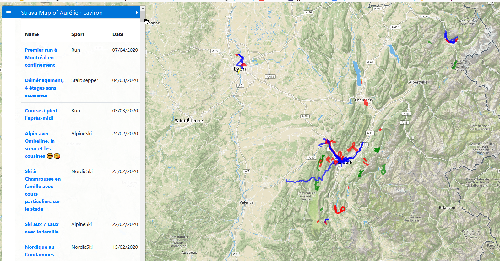

# Strava Map

A simple web app to visualize in a map, all the geolocalised activities you logged on Strava. Only need to log to Strava account.

No personal information is stored. Only a cookie to avoid reconnection to Strava website everytime. And localStorage for the activities.

## To Do List
* Sort by column
* Filters :
    * Allow user to choose a time period
    * Allow user to select a zone and have the list of activities there
* Color in checkbox explaining what is what
* Checkboxes in columns
* Number in the list (updated when filtered)
* Fix cookie size saving activities
* Reformat code with better unique action functions
